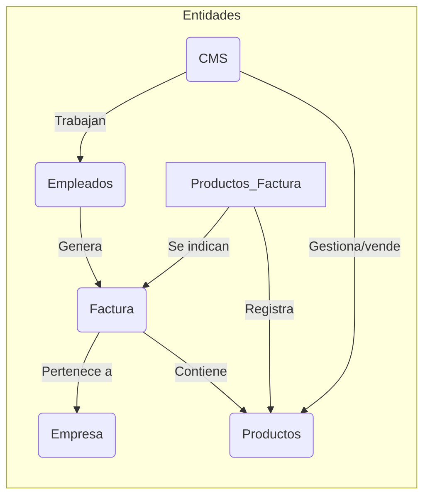

# SOFTWARE GESTIÓN INTERNA

### Idea
Este proyecto surgió desde la ambición de repasar los conceptos estudiados el primer año de mi **Formación Profesional**.
Mi idea era combinar mis conocimientos en bases de datos (PostgreSQL) cómo mis conocimientos en **Java**

### Porqué un Software de gestión interna?
Tras pensar durante mis vacaciones que debería hacer, creo que este programa cumple todos los requisitos necesarios
    
    Trabajo con bases de Datos
    Patrón de diseño MVC (Model View Controller)
    Trabajo con Interfaces gráficas
    Objetos
    Nuevas metas en Java

## Base de datos

En el curso trabajé con **PostgreSQL** por ende me voy a basar en esto, para crear mi base de datos,
Crearé varias tablas
    
    Empleados
    Clientes
    Facturas

#### Empleados
Aquí se almacenaran los datos de todos los trabajadores de la empresa

    cms=# select * from empleados;
    dni    | nombre | apellido | edad |    puesto     | contraseña
    -----------+--------+----------+------+---------------+------------
    39487578M | Juan   | Pérez    |   30 | Gerente       | 123
    88221028C | María  | López    |   25 | Analista      | 123
    22830573Z | Carlos | González |   35 | Desarrollador | 123
    23539921L | Laura  | Martínez |   28 | Diseñadora    | 123
    59243795G | Pedro  | Ramírez  |   32 | Consultor     | 123
    (5 rows)

#### Clientes

Aquí se almacenarán los datos de los Clientes de esta empresa, estos los emplearemos para cuando necesitemos obtener o realizar una factura del mismo
Las facturas se identificarán a trabes del código del cliente + un número

